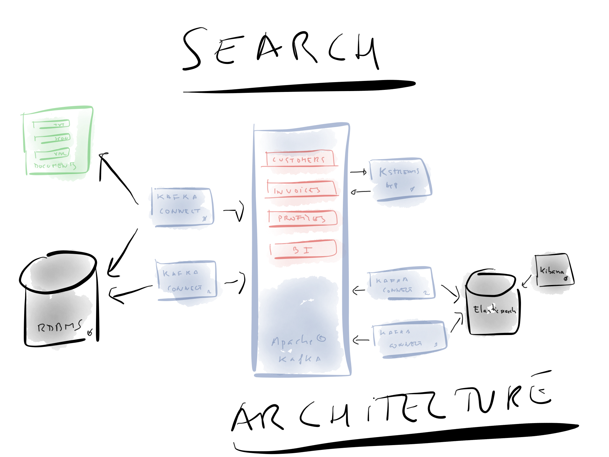
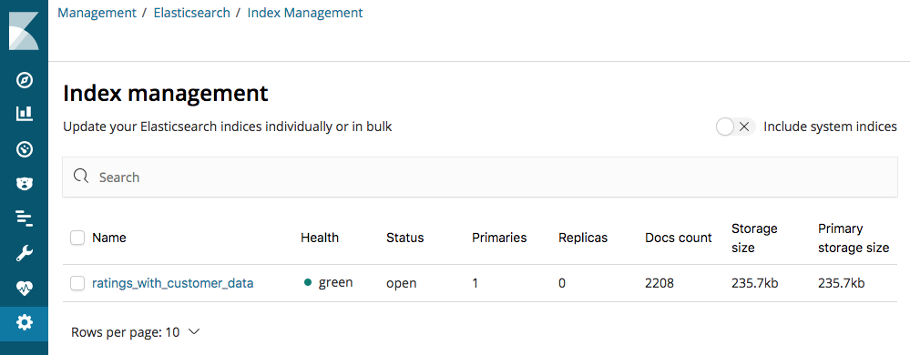
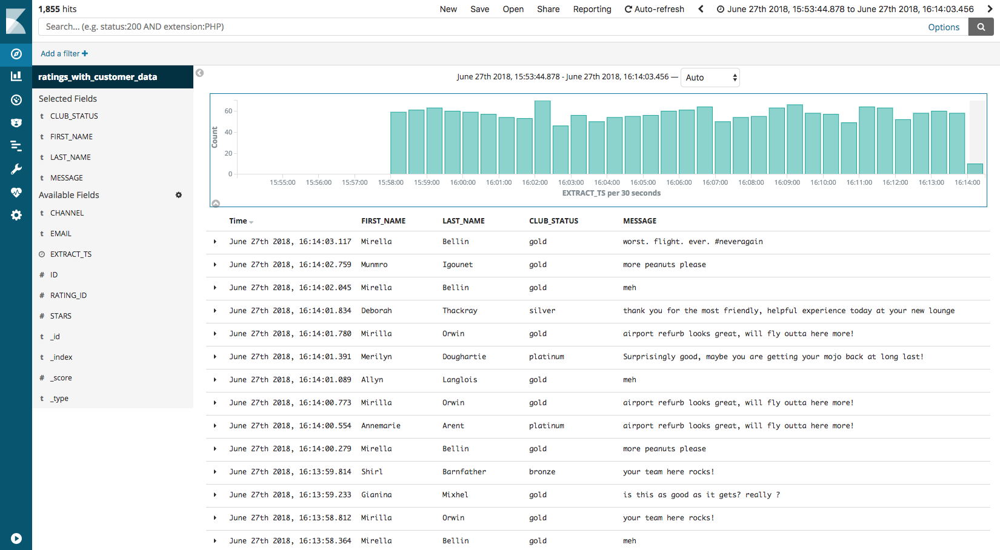
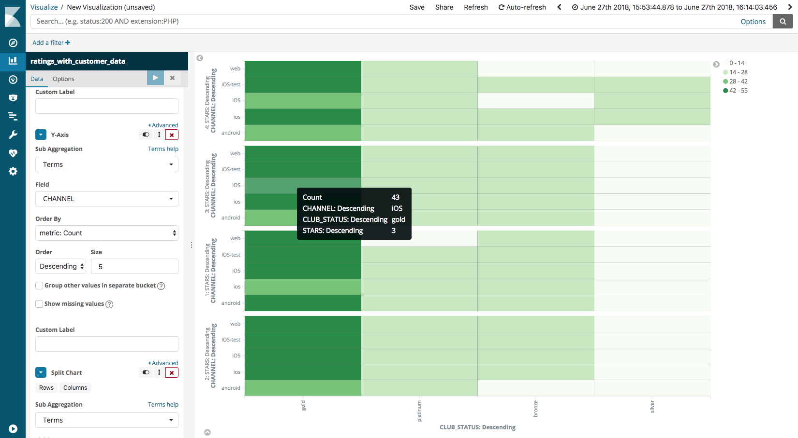

= Workshop on Search Engineering with Apache Kafka, Kafka Connect and Kafka Streams (and KSQL?)
:doctype: book
:sectnums:
Pere Urbon-Bayes <@purbon>
v0.1, May 3, 2019

:toc:

== Introduction

This is what we're going to build together today:

== Prerequisites

IMPORTANT: These **MUST** be completed before the workshop!

Please see link:pre-requisites.adoc[]

== Start Confluent Platform

_NOTE: Make sure that Docker has at least 8GB of memory available (check with `docker system info | grep Memory`)_

Change the working directory:

[source,bash]
----
cd kafka-on-search-workshop
----

Start Confluent Platform:

[source,bash]
----
docker-compose up -d
docker-compose logs -f kafka|grep "INFO Kafka version"
----

Once you see output then it means Kafka is running and you can proceed

[source,bash]
----
$ docker-compose logs -f kafka|grep "INFO Kafka version"
kafka_1             | [2018-09-03 14:08:09,790] INFO Kafka version : 2.0.0-cp1 (org.apache.kafka.common.utils.AppInfoParser)
----

Press Ctrl-C twice to exit the `docker-compose logs` command

Run `docker-compose ps` to confirm that all components are running:

[source,bash]
----
$ docker-compose ps
Name                                  Command               State                          Ports
-------------------------------------------------------------------------------------------------------------------------------------------
kafka-on-search-workshop_connect-debezium_1   /docker-entrypoint.sh start      Up      0.0.0.0:8083->8083/tcp, 8778/tcp, 9092/tcp, 9779/tcp
kafka-on-search-workshop_elasticsearch_1      /usr/local/bin/docker-entr ...   Up      0.0.0.0:9200->9200/tcp, 9300/tcp
kafka-on-search-workshop_kafka-connect-cp_1   /etc/confluent/docker/run        Up      0.0.0.0:18083->18083/tcp, 8083/tcp, 9092/tcp
kafka-on-search-workshop_kafka_1              /etc/confluent/docker/run        Up      0.0.0.0:9092->9092/tcp
kafka-on-search-workshop_kibana_1             /usr/local/bin/kibana-docker     Up      0.0.0.0:5601->5601/tcp
kafka-on-search-workshop_mysql_1              docker-entrypoint.sh mysqld      Up      0.0.0.0:3306->3306/tcp, 33060/tcp
kafka-on-search-workshop_schema-registry_1    /etc/confluent/docker/run        Up      0.0.0.0:8081->8081/tcp
kafka-on-search-workshop_zookeeper_1          /etc/confluent/docker/run        Up      2181/tcp, 2888/tcp, 3888/tcp
----

IMPORTANT: If any components do not show "Up" under the `State` column (e.g. they say "Exit") then you must rectify this before continuing. As a first solution, try re-issuing the `docker-compose up -d command`.

== Setting up your pipes (Consumers and Invoices)

=== Add your customer and invoices information

==== Option A: RDBMS

**This shows how to ingest the data using https://www.confluent.io/blog/no-more-silos-how-to-integrate-your-databases-with-apache-kafka-and-cdc[Kafka Connect and CDC]. If you want, you can replace this step with the following one ("Option B").**

Check that Kafka Connect with Debezium's connector has started:

[source,bash]
----
docker-compose logs -f connect-debezium|grep "Kafka Connect started"
----

Wait for the output:

[source,bash]
----
connect-debezium_1  | 2018-09-04 11:33:04,639 INFO   ||  Kafka Connect started   [org.apache.kafka.connect.runtime.Connect]
----

Press Ctrl-C to return to the command prompt.

We'll now create _four_ Kafka Connect connectors. Both stream events from MySQL into Kafka using Debezium, but differ in how they handle the message structure.

[source,bash]
----
  docker-compose exec connect-debezium bash -c '/scripts/create-mysql-source.sh'
----

You should see `HTTP/1.1 201 Created`, four times.

If you are interested you can inspect the script file (`scripts/create-mysql-source.sh` in the workshop folder) that includes the configuration payload in JSON.

1. The connector called `mysql-source-demo-customers` flattens the before/after record state data, along with the nested metadata, into a single flat structure. This is what we use during the rest of the workshop.
+
The flattening is done using a *Single Message Transform* from Debezium, called `io.debezium.transforms.UnwrapFromEnvelope`.
+ The connector also uses two Single Message Transforms to illustrate how metadata can be added to ingested data. The `InsertField` transformation adds the topic name into a field called `messagetopic`, and some fixed text into the `messagesource` field.

2. The connector `mysql-source-demo-customers-raw` retains the nested structure of the before/after record data.
+
A Single Message Transform is used to route the messages to a different topic. By default Debezium will use the format `server.schema.table` when streaming a table's data to a Kafka topic. We use the `RegexRouter` to redirect the messages to a topic with a `-raw` suffix.

Similar procedures are in place for the invoices, this is done by the connections `mysql-source-demo-invoices` and `mysql-source-demo-invoices-raw`, the analogs of the customer ones.

If you are curious to check if all the connectors are in place you can use the Kafka Connect REST api, this can be done like:

[source,bash]
----
 docker-compose exec connect-debezium bash -c 'curl http://connect-debezium:8083/connectors'
----

this operation can as well be performed using your browser.

==== Option B: Manually

If you want to follow the simpler path for this workshop, you can just mock up the data that would be coming from our customers table on a database. In practice you would ingest the data using https://www.confluent.io/blog/no-more-silos-how-to-integrate-your-databases-with-apache-kafka-and-cdc[Kafka Connect and CDC]

Run the following command to send the customer data to the `customers` topic:

[source,bash]
----
docker run --network kafka-on-search-workshop_default \
           --interactive --rm \
           --volume $PWD/data:/data confluentinc/cp-kafkacat \
           kafkacat -b kafka:29092 \
                    -t asgard.demo.CUSTOMERS \
                    -P -l /data/customers.json
----

Note that there is no output from this command. We will verify its success in the next step.

If you would like to add the invoices in a similar way you would need to create manually first the invoices JSON view of the table records.

=== Explore your data

As with in every data engineering job, getting to know your data is a very important part of a successful result. This is important to know
not just how it looks, but as well if there are outliers, missing attributes, etc.

For the purpose of this workshop, we'll use https://github.com/edenhill/kafkacat[kafkacat], a very powerful command line tool to explore
your topics in Apache Kafka, but as well the very own Apache Kafka CLI tools.

==== Exploring your data with kafkacat and the kafka CLI tools

Run this command to inspect the content of the main `asgard.demo.CUSTOMERS` topic that we populated.

[source,bash]
----
docker run --network kafka-on-search-workshop_default \
          --tty --interactive --rm \
          confluentinc/cp-kafkacat \
          kafkacat -b kafka:29092 -C -K: \
          -f '\nKey (%K bytes): %k\t\nValue (%S bytes): %s\n\Partition: %p\tOffset: %o\n--\n' \
          -t asgard.demo.CUSTOMERS
----

You should see messages, similar to this:

----
Key (161 bytes): {"schema":{"type":"struct","fields":[{"type":"int32","optional":false,"field":"id"}],"optional":false,"name":"asgard.demo.CUSTOMERS.Key"},"payload":{"id":17850}}
Value (323 bytes): {"id":17850,"first_name":"Anselma","last_name":"Rook","email":"arookj@europa.eu","gender":"Female","club_status":"gold","comments":"Cross-group 24/7 application","create_ts":"2019-04-07T09:23:33Z","update_ts":"2019-04-07T09:23:33Z","messagetopic":"asgard.demo.CUSTOMERS","messagesource":"Debezium CDC from MySQL on asgard"}
Partition: 0	Offset: 19
----

Press Ctrl-C to cancel and return to the command prompt.

This command is useful to pull and proceed the data in your Apache Kafka cluster, but you can as well use the other tooling included in your Apache Kafka distribution such as _kafka-topics_ or the _kafka-console-consumer_.
You can do that using a command like:

[source,bash]
----
docker-compose exec kafka kafka-topics --zookeeper zookeeper:2181 --list
----

This will list your topics, so you should see an output like:
----
__confluent.support.metrics
__consumer_offsets
_confluent-metrics
_schemas
asgard
asgard-raw
asgard.demo.CUSTOMERS
asgard.demo.CUSTOMERS-raw
asgard.demo.invoices
asgard.demo.invoices-raw
connect-status
dbhistory.demo
dbhistory.demo-raw
dbhistory.invoices-raw
docker-connect-debezium-configs
docker-connect-debezium-offsets
docker-kafka-connect-cp-configs
docker-kafka-connect-cp-offsets
docker-kafka-connect-cp-status
----
for the purpose of this workshop

You can as well explore the invoices topic with a command like this:

[source,bash]
----
docker run --network kafka-on-search-workshop_default \
          --tty --interactive --rm \
          confluentinc/cp-kafkacat \
          kafkacat -b kafka:29092 -C -K: \
          -f '\nKey (%K bytes): %k\t\nValue (%S bytes): %s\n\Partition: %p\tOffset: %o\n--\n' \
          -t asgard.demo.invoices
----

You should see messages, similar to this:

----
Key (158 bytes): {"schema":{"type":"struct","fields":[{"type":"int32","optional":false,"field":"id"}],"optional":false,"name":"asgard.demo.invoices.Key"},"payload":{"id":997}}
Value (296 bytes): {"id":997,"InvoiceNo":"536520","StockCode":"22100","Description":"SKULLS SQUARE TISSUE BOX","Quantity":"1","InvoiceDate":"12/1/2010 12:43","UnitPrice":"1.25","CustomerID":"14729","Country":"United Kingdom","messagetopic":"asgard.demo.invoices","messagesource":"Debezium CDC from MySQL on asgard"}
Partition: 0	Offset: 996
--
----

==== Exploring the documents

One of the usual tasks as a search engineer is to index and make searchable a bunch of documents coming out of many places, they could be your very own intranet, the internet or simply
your product list. For the purpose of this workshop we just scrapped a few documents from wikipedia and put them inside the file link:data/docs.txt[docs.txt], this file will be used
later on.

To explore this file you can simply read can use:

[source,bash]
----
cat data/docs.text
----

this should give messages like

----
Berlin gilt als Weltstadt der Kultur, Politik, Medien und Wissenschaften.[15][16][17][18] Die Universitäten, Forschungseinrichtungen, Sportereignisse und Museen Berlins genießen internationalen Ruf.[19] Die Metropole trägt den UNESCO-Titel Stadt des Designs und ist eines der meistbesuchten Zentren des Kontinents.[20] Berlins Architektur, Festivals, Nachtleben und vielfältige Lebensbedingungen sind weltweit bekannt
In der Saison 1982/83 spielte man als Dritter der Bundesliga im IHF-Pokal, wo man das Halbfinale erreichte. In der Saison 1984/85 liefen die Berliner als Finalist im DHB-Pokal im Europapokal der Pokalsieger auf, schied aber frühzeitig aus. Seit 2011 spielen die Füchse jedes Jahr in einem internationalen Wettbewerb. 2011/12 nahm man wiederum als Dritter der Bundesliga erstmals an der Champions League teil. Es war die erste Europapokalteilnahme einer Berliner Männerhandballmannschaft seit 21 Jahren. Im Premierenjahr erreichte man gleich das Final Four, wo man im Halbfinale knapp dem THW Kiel unterlag
En 1987, après le football et le basketball, Georges Frêche et Louis Nicollin décident d'investir dans le club qui devient le « Montpellier Paillade Sport Club »3,4 et ainsi de faire revivre la grande époque du Montpellier UC de Jean Férignac et Maurice Portes. Alors que le club n'évolue qu’au 4e niveau national, il recrute cette même année le gardien de but international Philippe Médard, qui vient de remporter son cinquième titre de champion de France. Puis la saison suivante, le club se renforce encore avec les arrivées de Frédéric Echivard, cinquième meilleur buteur du dernier championnat de France, et Stéphane Stoecklin, grand espoir français au poste d’ailier-arrière droit. Avec ces recrues, le club remporte les championnats de France de Nationale 3 (actuelle Nationale 2) en 1988 puis de Nationale 2 (actuelle Nationale 1) en 1989.
----

==== Exploring your data with MySQL

As we have seen before, one of our source of information is coming from a RDBMS (actually a MySQL database), if we have a tool installed like the https://www.mysql.com/products/workbench/[MySQLWorkbench],
we can explore how the data looks like from it's source. We'll use this as well in later steps when we use KSQL to perform real time streaming computations from the kafka topics.

As per the _docker-compose.yml_ file definition, we have a MySQL database available that can be accessed with this credentials

For privileged access:
----
User: root
Password: debezium
----

For unprivileged access:
----
User: mysqluser
Password:mysqlpw
----

the database is available at your docker-host, port 3306.

If we open an SQL tool (like MySQL workbench), we'll be able to explore our original data source and inspect, and might be manipulate, the source data
like this.

Explore timestamp format:

[source,bash]
----
select create_ts, update_ts
from CUSTOMERS;
----

Explore email formats:

[source,bash]
----
select email
from CUSTOMERS;
----

Insert a new customer:

[source,bash]
----
insert into CUSTOMERS (id, first_name, last_name, email, gender, club_status, comments)  values (2029, 'manel', 'illa', 'manel@illa.io', 'Male', 'gold', 'Apache Kafka contributor');
----

or more computational exploration such as,

How many invoices are per customer:

[source,bash]
----
select CustomerID, count(*)
from invoices
group by CustomerID;
----

How many products has been sold:

[source,bash]
----
select StockCode, Description, Sum(Quantity) as Quantity
from invoices
group by StockCode, Description;
----

Products sold in a given invoice

[source,bash]
----
select *
from invoices
where InvoiceNo = "536365"
----

How many products a customer has bought?
[source,bash]
----
select first_name, last_name, count(*)
from CUSTOMERS inner join invoices on CUSTOMERS.id = invoices.CustomerID
group by first_name, last_name;
----

== Kafka Streams

Data is not always in the perfect shape to be ready be ingested in your search engine, we usually need to cleaning, normalise it and compliment it
to make sure all interesting data points are there. This tasks can include different set of actions such as:

* Using an external library to detect in which language a document has been written. We usually do that in order to make them available to the proper
analysers and search pipeline that will later on make them available for our users.
* Normalise and clean up timestamps, as we're in a global world documents get created/scrapped and manipulated in many different locations and systems,
and they are not always in a good shape for being analysed and searchable.
* Enrich an incoming document with complimentary information, this would be for example interesting when adding customer information to an incoming
invoice, but as well for other use cases.

For all of this, and may be more, we're going to use Kafka Streams. As we've seen in the introductory section this is a very powerful data manipulation
library for Apache Kafka, more details on the API's and DSL's can be found from:

* https://docs.confluent.io/current/streams/developer-guide/index.html[Getting started with Kafka Streams]
* https://docs.confluent.io/current/streams/developer-guide/write-streams.html[Write an Streams App]
* https://docs.confluent.io/current/streams/developer-guide/dsl-api.html[Understanding the Kafka Streams DSL]
* https://docs.confluent.io/current/streams/developer-guide/processor-api.html[Understanding the Kafka Streams Processor API]

Inside the directory link:SearchEngApp-Scaffold[SearchEngApp-Scaffold] you can see an already prepared scaffold for this Kafka Streams exercises. At the end of the workshop the
solutions to this exercises are going to be provided. Use it as a bootstrap to start implementing the next exercises.

=== Language Detection

Language detection is an intrinsic part of many search engineering tasks as we generally could be scrapping and ingesting document from many different locations that need
proper classification before going into the search engine.

One of the traditional ways of doing that, and many other document processing tasks, is by using https://tika.apache.org[Apache Tika]. On this mater Apache Tika provides you
with methods to detect the language based on:

* _Optimaize_: This class uses detectors provided by https://github.com/optimaize/language-detector. The way this detectors works is by building language n-grams profiles and then comparing
them with the ones calculated from the input text.
* _TextLang_: This detector uses the MIT Lincoln Lab’s Text.jl library from https://github.com/trevorlewis/TextREST.jl You should run the TextREST.jl server before using this.
* _Lingo 24_: This implementation uses the API provide by https://developer.lingo24.com/premium-machine-translation-api (requires a license)

==== Task

In this exercise you should write a simple Kafka Streams job that:

* Read raw text from a source topic.
* Transform them into a JSON document.
* Detect and compliment the incoming JSON document the language it has been written.
* Store the new document in a target topic.

_Note:_ A proposed solution will delivered at the end of the workshop.

=== Timestamp Normalisation

As already presented earlier, timestamp normalisation is a always tedious task that is at the core of many search and data engineering teams.

To perform this many teams use a java library named https://www.joda.org/joda-time/index.html[Joda], this library has become the defacto standard for rich time manipulation tasks
in the java world. If you never use it, you can check more details about it at https://www.joda.org/joda-time/quickstart.html[Joda - Quick start].

==== Task

As we have seen during the data exploration phase, the timestamps that come out of the customers database does not include the timezone were they are produced. This lack of informtion
can make aggregations and other data manipulation skewed, were teams running the same job, but in different locations will get different results.

 To solve this we want you write a simple Kafka Streams job that :

 * Read from an incoming topic (customers topic)
 * Enrich the incoming timestamps (_create_ts_ and _update_ts_) with the timezone "Europe/Berlin".
 * Write the modified document back to a new stream.

 We ask you to do this by using the Processor API.

 _Note:_ A proposed solution will delivered at the end of the workshop.

=== Calculate customers per Genre

One of the most common task when building search infrastructures is the calculation of derived views of the incoming data, this is usually done
as a compliment to enable later enrichments of relevant entities such as the products or as well to help the ranking calculations when a user
performs a query and the query understanding pipeline enters in action.

==== Task

In this exercise we ask you to build a Kafka Streams app that:

* Consume from the _asgard.demo.CUSTOMERS_ topic.
* Calculate how many customers aggregated by genre (live query).
* Write the outcome to a target topic.

_Note:_ A proposed solution will delivered at the end of the workshop.

=== Building customer profiles

As per the same reasons as the task performed in the last section, building customer profiles is a common task search pipelines does while
preparing incoming data to be searchable. This task usually include building a view (document) where for a given user, it include as well all
it's related information (360° view) such as purchases, etc.

Having profiles of users will help our efforts to determine the query intentions during the query understanding tasks.

==== Task

In this exercise we ask you to build, a now more complex, Kafka Streams app that:

* Read from the _asgard.demo.invoices_ and _asgard.demo.CUSTOMERS_ topics.
* For every customer.
  * calculate the total cost per each invoice generated (full purchase)
  * build a table with customer information and the current list of invoices, including the total cost.
* Join the customer information with the aggregated invoice table generated in the last step.
* Write the customer profile (customer data + list of invoices (including total cost)) to a destination topic.

Note: if you remember the previous task during our data exploration, one of the steps required for this exercise would translate in SQL to
something like:

Calculate the invoice total cost.
----
select InvoiceNo, ROUND(sum(Quantity*UnitPrice),2) as total
from invoices
group by InvoiceNo;
----

_Note:_ A proposed solution will delivered at the end of the workshop.

== KSQL

But if you are saying to yourself, why should I be writing java for this, while the Kafka Streams API is a very powerful one, there is KSQL,
the streaming SQL engine for Apache Kafka.

More details about it can be found at:

* https://docs.confluent.io/current/ksql/docs/index.html[Documentation]
* https://docs.confluent.io/current/ksql/docs/developer-guide/index.html[Developer guide]
* https://docs.confluent.io/current/ksql/docs/tutorials/index.html[Tutorials and Examples]

In the developer guide you will find a ton of examples and direction on the different operations that you can perform with KSQL.

KSQL can be used via the command line interface (CLI), a graphical UI built into Confluent Control Center, or the documented https://docs.confluent.io/current/ksql/docs/api.html[REST API].

In this workshop we will use the CLI, which if you have used Oracle's sql*plus, MySQL CLI, and so on will feel very familiar to you.

Launch the CLI:

[source,bash]
----
docker run --network kafka-on-search-workshop_default \
           --tty --interactive --rm \
           confluentinc/cp-ksql-cli:5.2.1 http://ksql-server:8088
----

Make sure that you get a successful start up screen:

[source,bash]
----
                  ===========================================
                  =        _  __ _____  ____  _             =
                  =       | |/ // ____|/ __ \| |            =
                  =       | ' /| (___ | |  | | |            =
                  =       |  <  \___ \| |  | | |            =
                  =       | . \ ____) | |__| | |____        =
                  =       |_|\_\_____/ \___\_\______|       =
                  =                                         =
                  =  Streaming SQL Engine for Apache Kafka® =
                  ===========================================

Copyright 2017-2018 Confluent Inc.

CLI v5.1.0, Server v5.1.0 located at http://ksql-server:8088

Having trouble? Type 'help' (case-insensitive) for a rundown of how things work!

ksql>
----

=== See available Kafka topics

KSQL can be used to view the topic metadata on a Kafka cluster (`SHOW TOPICS;`), as well as inspect the messages in a topic (`PRINT <topic>;`).

[source,sql]
----
ksql> SHOW TOPICS;

 Kafka Topic                     | Registered | Partitions | Partition Replicas | Consumers | ConsumerGroups
-------------------------------------------------------------------------------------------------------------
 _confluent-metrics              | false      | 12         | 1                  | 0         | 0
 _schemas                        | false      | 1          | 1                  | 0         | 0
 asgard.demo.CUSTOMERS           | false      | 1          | 1                  | 1         | 1
 asgard.demo.CUSTOMERS-raw       | false      | 1          | 1                  | 2         | 2
 asgard.demo.invoices            | false      | 1          | 1                  | 0         | 0
 asgard.demo.invoices-raw        | false      | 1          | 1                  | 0         | 0
 docker-connect-debezium-configs | false      | 1          | 1                  | 0         | 0
 docker-connect-debezium-offsets | false      | 25         | 1                  | 0         | 0
[...]
-------------------------------------------------------------------------------------------------------------
ksql>
----

=== Inspect a topic contents - Customers

Here we use the `FROM BEGINNING` argument, which tells KSQL to go back to the _beginning_ of the topic and show all data from there

[source,sql]
----
ksql> PRINT 'asgard.demo.CUSTOMERS' FROM BEGINNING;
Format:JSON
{"ROWTIME":1554638011318,"ROWKEY":"{\"schema\":{\"type\":\"struct\",\"fields\":[{\"type\":\"int32\",\"optional\":false,\"field\":\"id\"}],\"optional\":false,\"name\":\"asgard.demo.CUSTOMERS.Key\"},\"payload\":{\"id\":14688}}","id":14688,"first_name":"Clair","last_name":"Vardy","email":"cvardyf@reverbnation.com","gender":"Male","club_status":"bronze","comments":"Expanded bottom-line Graphical User Interface","create_ts":"2019-04-07T11:50:53Z","update_ts":"2019-04-07T11:50:53Z","messagetopic":"asgard.demo.CUSTOMERS","messagesource":"Debezium CDC from MySQL on asgard"}
{"ROWTIME":1554638011318,"ROWKEY":"{\"schema\":{\"type\":\"struct\",\"fields\":[{\"type\":\"int32\",\"optional\":false,\"field\":\"id\"}],\"optional\":false,\"name\":\"asgard.demo.CUSTOMERS.Key\"},\"payload\":{\"id\":17850}}","id":17850,"first_name":"Anselma","last_name":"Rook","email":"arookj@europa.eu","gender":"Female","club_status":"gold","comments":"Cross-group 24/7 application","create_ts":"2019-04-07T11:50:53Z","update_ts":"2019-04-07T11:50:53Z","messagetopic":"asgard.demo.CUSTOMERS","messagesource":"Debezium CDC from MySQL on asgard"}
----

Press Ctrl-C to cancel and return to the KSQL prompt. This may take up to a minute to cancel (https://github.com/confluentinc/ksql/issues/1759[#1759]). If it still does not cancel then just start a new KSQL CLI using the `docker run` command from above and proceed to the next step.

=== Inspect a topic contents - Invoices

Here we use the `FROM BEGINNING` argument, which tells KSQL to go back to the _beginning_ of the topic and show all data from there

[source,sql]
----
ksql> PRINT 'asgard.demo.invoices' FROM BEGINNING;
Format:JSON
{"ROWTIME":1554638013264,"ROWKEY":"{\"schema\":{\"type\":\"struct\",\"fields\":[{\"type\":\"int32\",\"optional\":false,\"field\":\"id\"}],\"optional\":false,\"name\":\"asgard.demo.invoices.Key\"},\"payload\":{\"id\":999}}","id":999,"InvoiceNo":"536520","StockCode":"22583","Description":"PACK OF 6 HANDBAG GIFT BOXES","Quantity":"1","InvoiceDate":"12/1/2010 12:43","UnitPrice":"2.55","CustomerID":"14729","Country":"United Kingdom","messagetopic":"asgard.demo.invoices","messagesource":"Debezium CDC from MySQL on asgard"}
{"ROWTIME":1554638013264,"ROWKEY":"{\"schema\":{\"type\":\"struct\",\"fields\":[{\"type\":\"int32\",\"optional\":false,\"field\":\"id\"}],\"optional\":false,\"name\":\"asgard.demo.invoices.Key\"},\"payload\":{\"id\":1000}}","id":1000,"InvoiceNo":"536520","StockCode":"21358","Description":"TOAST ITS - HAPPY BIRTHDAY","Quantity":"2","InvoiceDate":"12/1/2010 12:43","UnitPrice":"1.25","CustomerID":"14729","Country":"United Kingdom","messagetopic":"asgard.demo.invoices","messagesource":"Debezium CDC from MySQL on asgard"}
----

Press Ctrl-C to cancel and return to the KSQL prompt. This may take up to a minute to cancel (https://github.com/confluentinc/ksql/issues/1759[#1759]). If it still does not cancel then just start a new KSQL CLI using the `docker run` command from above and proceed to the next step.

=== KSQL offsets

Since Apache Kafka persists data, it is possible to use KSQL to query and process data from the past, as well as new events that arrive on the topic.

To tell KSQL to process from beginning of topic run `SET 'auto.offset.reset' = 'earliest';`

Run this now, so that future processing includes all existing data—this is important for the Customer data, since no new messages are arriving on this topic and thus we need to make sure we work with the messages already present.

[source,sql]
----
ksql> SET 'auto.offset.reset' = 'earliest';
Successfully changed local property 'auto.offset.reset' from 'null' to 'earliest'
----

=== Join data in KSQL

Remember our customer profile task earlier, lets rebuild it again here.

=== Prepare the Customer data

We're going to model the Customers topic as a **KSQL Table**. This is a semantic construct that enables us to work with the data in the topic as key/value pairs, with a single value for each key. You can read more about https://docs.confluent.io/current/streams/concepts.html#duality-of-streams-and-tables[this here].

==== Inspect Customers Data

Let's check the data first, using the very handy `PRINT` command:

`PRINT 'asgard.demo.CUSTOMERS' FROM BEGINNING;`

[source,sql]
----
 ksql> PRINT 'asgard.demo.CUSTOMERS' FROM BEGINNING;
 Format:JSON
 {"ROWTIME":1529492614185,"ROWKEY":"null","id":1,"first_name":"Annemarie","last_name":"Arent","email":"aarent0@cpanel.net","gender":"Female","club_status":"platinum","comments":"Organized web-enabled ability"}
----

Press Ctrl-C to cancel and return to the KSQL prompt. This may take up to a minute to cancel (https://github.com/confluentinc/ksql/issues/1759[#1759]).

==== Re-Key Customers Topic

When we join the customer data to the ratings, the customer Kafka messages _must be keyed on the field on which we are performing the join_. If this is not the case the join will fail and we'll get `NULL` values in the result.

Our source customer messages are not currently keyed correctly. Depending on how you chose to populate the Customer topic earlier:

* From Debezium, the messages are actually keyed using the Primary Key of the source table, but using a key serialisation that KSQL does not support - and thus in effect is not useful as a key in KSQL at all
* From a manual input of JSON messages, the key is null (observe the `"ROWKEY":"null"` in the `PRINT` output above)

To re-key a topic in Kafka we can use KSQL!

First we will register the customer topic. Note that because it is in JSON format we need to declare all of the columns and their datatypes:

[source,sql]
----
 ksql> CREATE STREAM CUSTOMERS_SRC (id BIGINT, first_name VARCHAR, last_name VARCHAR, email VARCHAR, gender VARCHAR, club_status VARCHAR, comments VARCHAR) WITH (KAFKA_TOPIC='asgard.demo.CUSTOMERS', VALUE_FORMAT='JSON');

  Message
 ----------------
  Stream created
 ----------------
 ksql>
----

With the stream registered, we can now re-key the topic, using a KSQL `CSAS` and the `PARTITION BY` clause. Note that we're taking the opportunity to re-serialise the data into Avro format. We're also changing the number of partitions from that of the source (4) to match that of the `ratings` topic (1):

[IMPORTANT]
====
By changing the partition key, data may move between partitions, and thus its ordering change. Kafka's strict ordering guarantee only applies within a partition.

In our example this doesn't matter, but be aware of this if you rely on this re-keying technique in other KSQL queries.
====

[source,sql]
----
 ksql> CREATE STREAM CUSTOMERS_SRC_REKEY \
         WITH (PARTITIONS=1, VALUE_FORMAT='AVRO') AS \
         SELECT * FROM CUSTOMERS_SRC PARTITION BY ID;

  Message
 ----------------------------
  Stream created and running
 ----------------------------
 ksql>
----

[NOTE]
====
*Optional*

To inspect the key for a given stream/table, use the `ROWKEY` system column.

Here we compare it to the join column (`ID`); for the join to succeed they must be equal.

In the source stream, the `ROWKEY` is null (or `Struct{id=x}` if streamed from Debezium) because the key of the underlying Kafka messages is null:

[source,sql]
----
 ksql> SELECT C.ROWKEY, C.ID FROM CUSTOMERS_SRC C LIMIT 3;
 null | 1
 null | 2
 null | 3
 Limit Reached
 Query terminated
----

In the re-keyed stream the `ROWKEY` and `ID` are equal, which is essential for a successful JOIN operation in KSQL.

[source,sql]
----
 ksql> SELECT C.ROWKEY, C.ID FROM CUSTOMERS_SRC_REKEY C LIMIT 3;
 1 | 1
 2 | 2
 3 | 3
 Limit Reached
 Query terminated
 ksql>
----
====

==== Create Customers Table

Now, create a `TABLE` over the new re-keyed Kafka topic. Why's it a table? Because *for each key* (user id), we want to know *its current value* (name, status, etc)

[source,sql]
----
 ksql> CREATE TABLE CUSTOMERS WITH (KAFKA_TOPIC='CUSTOMERS_SRC_REKEY', VALUE_FORMAT ='AVRO', KEY='ID');

  Message
 ---------------
  Table created
 ---------------
 ksql>
----

[NOTE]
====
 _n.b. if you get the error `Unable to verify the AVRO schema is compatible with KSQL` then_ :

 * Retry the command after a second or two (ref. https://github.com/confluentinc/ksql/issues/1394[#1394]).
 * Check that the topic's source stream is created:

[source,sql]
----
ksql> SHOW STREAMS;
Stream Name         | Kafka Topic         | Format
----------------------------------------------------
  CUSTOMERS_SRC_REKEY | CUSTOMERS_SRC_REKEY | AVRO
  [...]
----
+
* Verify that the source stream is processing messages by running `DESCRIBE EXTENDED CUSTOMERS_SRC_REKEY;`. Under the heading `Local runtime statistics` you should see:
+
[source,sql]
----
 Local runtime statistics
 ------------------------
 messages-per-sec:      0.10   total-messages:        10     last-message: 6/28/18 6:23:54 PM UTC
  failed-messages:         0 failed-messages-per-sec:         0      last-failed:       n/a
----
+
** If no 'messages-per-sec' is shown, the next step is to verify that you ran `SET 'auto.offset.reset' = 'earliest';` earlier. You can run it again to be certain. If it says `Successfully changed local property 'auto.offset.reset' from 'null' to 'earliest'` then the `null` shows that it wasn't previously set.
** If this was the case, then you need to drop and recreate the stream in order to process the customer data:
+
[source,sql]
----
 TERMINATE QUERY CSAS_CUSTOMERS_SRC_REKEY_0;
 DROP STREAM CUSTOMERS_SRC_REKEY;
----
+
Then re-run the `CREATE STREAM CUSTOMERS_SRC_REKEY[…]` from above. Use `SHOW QUERIES;` to list the queries running if the name differs from that shown in the `TERMINATE` statement.
====

Query the table:

[source,sql]
----
ksql> SELECT ID, FIRST_NAME, LAST_NAME, EMAIL, CLUB_STATUS FROM CUSTOMERS;
 1 | Annemarie | Arent | aarent0@cpanel.net | platinum
 2 | Merilyn | Doughartie | mdoughartie1@dedecms.com | platinum
----

=== Prepare the invoice data

Now we need as well to prepare the invoice data, we can do that in a similar way as we did for the _CUSTOMERS_, first step is to parse the incoming topic _asgard.demo.invoices_
and register an incoming stream, for this we need to:

* Define the topic schema, as done in other create or insert commands.
* Include the topic data format, in this case JSON.
* Last register the stream.

Exercise: how would you prepare the stream of invoices to enable join with the _CUSTOMERS_ table?

_Note:_ A proposed solution will delivered at the end of the workshop.

=== Stream - Table join

In previous sections we've seen how to do join with a Kafka Streams application, in this section we're going to do the same calculations as we did before, but this time
only using KSQL, the SQL alike language for Streams in Kafka.

Remember, our objective here is to:

+ Calculate the total spending per customer and invoice that we have in our system.

Can you do that with KSQL ?

....
> working time...
....

_Note:_ A proposed solution will delivered at the end of the workshop.

=== Filtering enriched STREAMS

As we saw in the previous section, a nice future of KSQL and the Streams are flow of information that build on top of each other. In this section we're going to
present how we can use them effectively for customer segmentation.

As a source of this flow we are going to use a materialised view of the invoices, including customer information on it. This join would look liek this:

[source,sql]
----
CREATE STREAM INVOICES_WITH_CUSTOMERS WITH (PARTITIONS=1) AS \
SELECT  C.ID, C.CLUB_STATUS, C.EMAIL, \
        C.FIRST_NAME, C.LAST_NAME, I.InvoiceNo, \
        I.COUNTRY, I.STOCKCODE, I.QUANTITY, I.UNITPRICE
FROM INVOICES_SRC_REKEY2 I INNER JOIN CUSTOMERS C ON C.ID = I.CUSTOMERID;

ksql>
----

If you query/inspect the stream this is what you should see:

[source,sql]
----

ksql> select * from INVOICES_WITH_CUSTOMERS limit 5;
1555742586554 | 17850 | 17850 | gold | arookj@europa.eu | Anselma | Rook | 536365 | United Kingdom | 85123A | 6 | 2.55
1555742586554 | 17850 | 17850 | gold | arookj@europa.eu | Anselma | Rook | 536365 | United Kingdom | 71053 | 6 | 3.39
1555742586554 | 17850 | 17850 | gold | arookj@europa.eu | Anselma | Rook | 536365 | United Kingdom | 84406B | 8 | 2.75
1555742586554 | 17850 | 17850 | gold | arookj@europa.eu | Anselma | Rook | 536365 | United Kingdom | 84029G | 6 | 3.39
1555742586555 | 17850 | 17850 | gold | arookj@europa.eu | Anselma | Rook | 536365 | United Kingdom | 84029E | 6 | 3.39
Limit Reached
Query terminated

ksql>
----

In this flow of data we can for example filter customers only with bronze status. This would look like this:

[source,sql]
----

ksql> SELECT EMAIL, InvoiceNo, COUNTRY \
FROM INVOICES_WITH_CUSTOMERS \
WHERE CLUB_STATUS='bronze'
limit 5;

cvardyf@reverbnation.com | 536378 | United Kingdom
cvardyf@reverbnation.com | 536378 | United Kingdom
cvardyf@reverbnation.com | 536378 | United Kingdom
cvardyf@reverbnation.com | 536378 | United Kingdom
cvardyf@reverbnation.com | 536378 | United Kingdom
Limit Reached
Query terminated

ksql>
----

we can actively benefit of this to build different stages of near real time processing.

For example to calculate how many customer per status are:

[source,sql]
----

ksql> select club_status, count(*)
>from INVOICES_WITH_CUSTOMERS
>group by club_status;
bronze | 19
gold | 95
^CQuery terminated
ksql>
----

or to create a new stream of data were only customers with gold status will be send, we can do that like this:

[source,sql]
----

  ksql> create stream GOLD_CUSTOMERS AS \
    select *
    from  INVOICES_WITH_CUSTOMERS
    where CLUB_STATUS='gold';

   Message
  ----------------------------
   Stream created and running
  ----------------------------
  ksql>
----

this will effectively move invoice lines produced by gold customers to an specific line of procesiament, effectively being segmented based on a criteria. Remember this criteria could be anything, for example ratings to see happy or sad customers, etc.

[source,sql]
----

  ksql> select stockcode, sum(quantity) from gold_customers group by stockcode limit 10;
  22652 | 20
  15056BL | 6
  71053 | 32
  82486 | 16
  21485 | 12
  20679 | 24
  82482 | 24
  22752 | 10
  21730 | 30
  21506 | 24
  Limit Reached
  Query terminated

  ksql>
----

or filtering customers by quantity of items bought:

[source,sql]
----
  ksql> select email, sum(quantity) as count from GOLD_CUSTOMERS group by email having sum(quantity) > 100 limit 3;
  arookj@europa.eu | 474
  shackwellb@paginegialle.it | 544
  Query terminated
  ksql>
----

In this section we've seen the great power of stream composition and how you can build complex calculations on top of other streams.

==  Stream data to Elasticsearch

NOTE: This section assumes that you are familiar with the use of Kibana

Using Kafka Connect you can stream data from a Kafka to one (or many) targets, including Elasticsearch, HDFS, S3, and so on. Here we'll see how to stream it to Elasticsearch for rapid visualisation and analysis.

From a bash prompt, make sure that Elasticsearch and Kibana are running:

[source,bash]
----
  $ docker-compose ps|egrep "elasticsearch|kibana"
  elasticsearch                      /usr/local/bin/docker-entr ...   Up      0.0.0.0:9200->9200/tcp, 0.0.0.0:9300->9300/tcp
  kibana                             /usr/local/bin/kibana-docker     Up      0.0.0.0:5601->5601/tcp
----

Create a dynamic mapping in Elasticsearch so that the timestamp of source data is correctly detected:

[source,bash]
----
  curl -XPUT "http://localhost:9200/_template/kafkaconnect/" -H 'Content-Type: application/json' -d' { "index_patterns": "*", "settings": { "number_of_shards": 1, "number_of_replicas": 0 }, "mappings": { "_default_": { "dynamic_templates": [ { "dates": { "match": "TS", "mapping": { "type": "date" } } }, { "non_analysed_string_template": { "match": "*", "match_mapping_type": "string", "mapping": { "type": "keyword" } } } ] } } }'
----

Create a connector to stream `CUSTOMERS` to Elasticsearch:

[source,bash]
----
  curl -i -X POST -H "Accept:application/json" \
      -H  "Content-Type:application/json" http://kafka-connect-cp:18083/connectors/ \
      -d '{
        "name": "elastic-sink",
        "config": {
            "connector.class": "io.confluent.connect.elasticsearch.ElasticsearchSinkConnector",
            "tasks.max": "1",
            "topics": "asgard.demo.CUSTOMERS",
            "key.ignore": "true",
            "connection.url": "http://elasticsearch:9200",
            "type.name": "customers",
            "name": "elastic-sink",
            "schema.ignore": "true",
            "key.converter":"org.apache.kafka.connect.storage.StringConverter",
            "value.converter": "org.apache.kafka.connect.json.JsonConverter",
            "value.converter.schemas.enable": false
         }
      }'
----

Create a connector to stream `customers-profiles` to Elasticsearch:

[source,bash]
----
  curl -i -X POST -H "Accept:application/json" \
      -H  "Content-Type:application/json" http://kafka-connect-cp:18083/connectors/ \
      -d '{
        "name": "elastic-sink-profiles",
        "config": {
            "connector.class": "io.confluent.connect.elasticsearch.ElasticsearchSinkConnector",
            "tasks.max": "1",
            "topics": "customers-profiles",
            "key.ignore": "true",
            "connection.url": "http://elasticsearch:9200",
            "type.name": "customers",
            "name": "elastic-sink-profiles",
            "schema.ignore": "true",
            "key.converter":"org.apache.kafka.connect.storage.StringConverter",
            "value.converter": "org.apache.kafka.connect.json.JsonConverter",
            "value.converter.schemas.enable": false
         }
      }'
----

_Note that the above sets `"key.ignore": "false"` , and thus aggregates will be updated in-place._

If you have `jq` on your machine you can run this to check that the connector is `RUNNING`:

[source,bash]
----
  $ curl -s "http://localhost:18083/connectors"| jq '.[]'| xargs -I{connector_name} curl -s "http://localhost:18083/connectors/"{connector_name}"/status"| jq -c -M '[.name,.connector.state,.tasks[].state]|join(":|:")'| column -s : -t| sed 's/\"//g'| sort

  es_sink_profiles  |  RUNNING  |  RUNNING
  es_sink |  RUNNING  |  RUNNING
----

Use the Kibana interface (http://localhost:5601) to check that docs are arriving in Elasticsearch:

Add the index pattern to Kibana, and then use the Discover and Visualise options to explore and create analyses on the data:

== Shutting down the environment

To terminate the workshop environment, run `docker-compose down`:

[source,bash]
----
  ➜  kafka-on-search-workshop git:(master) ✗ docker-compose down
  Stopping kafka-on-search-workshop_connect-debezium_1 ... done
  Stopping kafka-on-search-workshop_ksql-server_1      ... done
  Stopping kafka-on-search-workshop_kafka-connect-cp_1 ... done
  Stopping kafka-on-search-workshop_schema-registry_1  ... done
  Stopping kafka-on-search-workshop_kafka_1            ... done
  Stopping kafka-on-search-workshop_kibana_1           ... done
  Stopping kafka-on-search-workshop_zookeeper_1        ... done
  Stopping kafka-on-search-workshop_mysql_1            ... done
  Stopping kafka-on-search-workshop_elasticsearch_1    ... done
  Removing kafka-on-search-workshop_connect-debezium_1 ... done
  Removing kafka-on-search-workshop_ksql-server_1      ... done
  Removing kafka-on-search-workshop_kafka-connect-cp_1 ... done
  Removing kafka-on-search-workshop_schema-registry_1  ... done
  Removing kafka-on-search-workshop_kafka_1            ... done
  Removing kafka-on-search-workshop_kibana_1           ... done
  Removing kafka-on-search-workshop_zookeeper_1        ... done
  Removing kafka-on-search-workshop_mysql_1            ... done
  Removing kafka-on-search-workshop_elasticsearch_1    ... done
  Removing network kafka-on-search-workshop_default
----

_If you want to preserve the state of all containers, run `docker-compose stop` instead._

== Next steps

With the enriched and filtered data being populated into Kafka topics from KSQL you can use it to :

* Feed event-driven applications. For example, notify the ops team if a VIP user leaves a poor review.
* Stream to analytics platforms. For example, use Kafka Connect to stream the enriched data stream to Elasticsearch and visualise the real time with Kibana.
